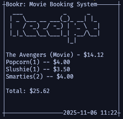

# Bookr

A terminal-based movie booking application built with Ruby, featuring an interactive command-line interface for browsing movies, selecting seats, and managing bookings.

## About

Bookr is a learning project designed to explore Ruby programming concepts including object-oriented design, terminal UI interactions, and application architecture. The application simulates a movie theater booking system with age-based content restrictions and an intuitive text-based interface.

## Current Features

- **Interactive Terminal UI**: Clean, colorized interface using TTY-Prompt and TTY-Box
- **Movie Browsing**: View available movies with details (title, rating, description, runtime)
- **Age-Based Restrictions**: Content rating enforcement (G, PG, 13, R) based on user age
- **Visual Seating Chart**: ASCII-based cinema seating layout display
- **User Authentication**: Simple login system with username and password
- **ASCII Art Branding**: Stylish terminal banner using Artii

## Planned Features

- [ ] **Seat Booking System**: Interactive seat selection and reservation
- [ ] **Persistent Data Storage**: Integration with AppWrite for data persistence
- [ ] **Mock Payment Processing**: Simulated checkout and payment flow
- [ ] **Admin Dashboard**: Administrative features for managing:
  - Adding/removing movies
  - Updating product prices
  - Managing theater configuration
- [ ] **Pensioner Discounts**: Special pricing on designated days

## Technologies Used

- **Ruby**: Core programming language
- **TTY-Prompt**: Interactive command-line prompts
- **TTY-Box**: Terminal boxes and frames
- **Colorize**: Text colorization for enhanced UI
- **Artii**: ASCII art generation

## Installation

1. Clone the repository:
   ```bash
   git clone https://github.com/yourusername/bookr.git
   cd bookr
   ```

2. Install dependencies:
   ```bash
   bundle install
   ```

3. Run the application:
   ```bash
   ruby lib/bookr.rb
   ```

## Screenshots




## Project Structure

```
bookr/
├── lib/
│   └── bookr/
│       ├── movie.rb       # Movie class with rating logic
│       ├── user.rb        # User authentication and permissions
│       └── cinema.rb      # Theater and seating management
├── Gemfile                # Dependency management
└── README.md
```

## 🤝 Contributing

While this is primarily a learning project, feedback and suggestions are welcome! Feel free to:
- Open an issue for feature suggestions
- Provide feedback on code architecture and design
- Share best practices or alternative approaches

Please note that direct code contributions are not being accepted at this time as this is a personal learning exercise.

## 📝 License

GNU GENERAL PUBLIC LICENSE